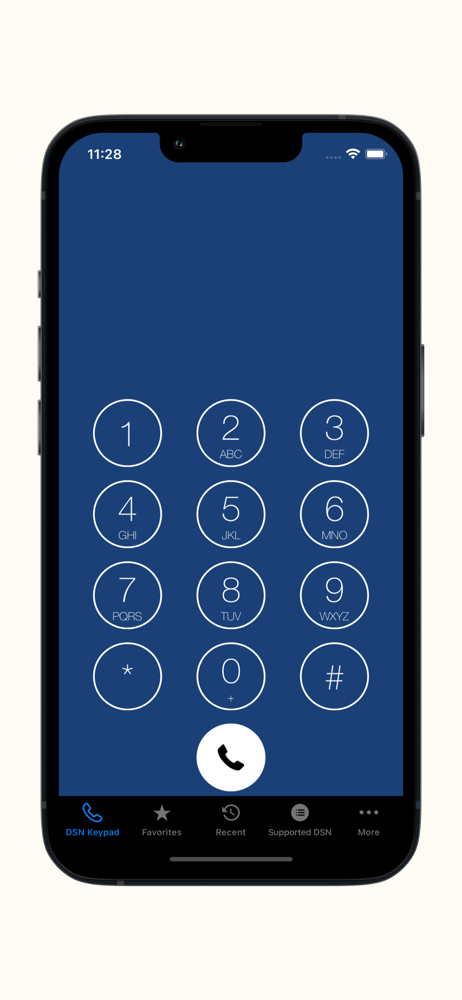
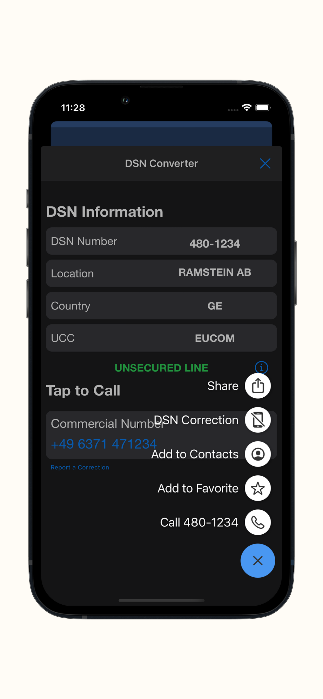
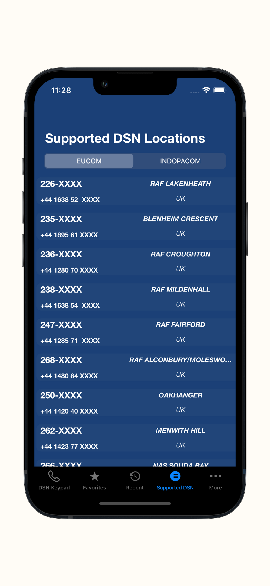

# DSN Converter

  

A repo for an DOD wide DSN to commercial conversion app.

DSN phone numbers are part of our everyday life as military members. Sometimes not having access to the right conversion outside of the office can be very frustrating. With DSN Europe you can dial a DSN number right from your cell phone and our algorithm will make the necessary conversion to a commercial phone number.

# How to run the code locally

Requires XCode (from Apple) and Cocoapods.
Download or Clone the project
Run pod install
Open DSN Europe.xcworkspace
Click Run

# What we got so far 
 DSN Europe 
 - All U.S Air Force bases in Europe.
 - All U.S Army bases in Europe.
 - All U.S Navy bases in Europe.
 - Web App (https://dsn-converter.pages.dev)
 
 # What we need 
  - Android version of the app( https://github.com/airmencoders/AF-DSN-Android) 
  - U.S Bases in Asia 
  - U.S Bases in CONUS
  - Add comments to the codes
  
 # Libraries we use
* [BMDialPad](https://github.com/IamSaurav/BMDialPad) - MIT License
* [PMAlertController](https://github.com/pmusolino/PMAlertController) MIT License
* [NotificationBannerSwift](https://github.com/Daltron/NotificationBanner)MIT License
* [paper-onboarding](https://github.com/Ramotion/paper-onboarding)MIT License
* [CountdownLabel](https://github.com/fromkk/CountdownLabel)MIT License

